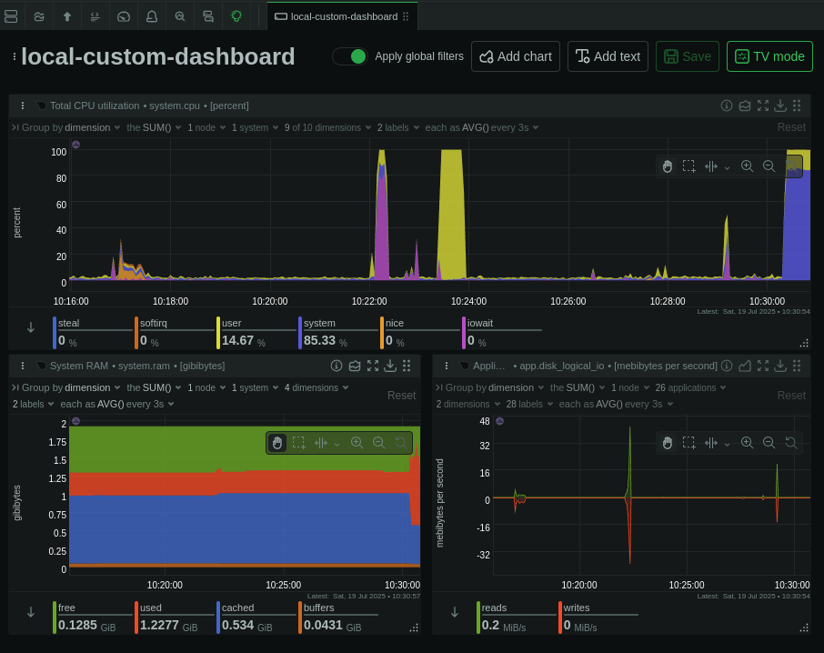

# Simple Monitoring

Here I have setup a simple monitoring tool for my server. I used netdata as an standalone agent on my server and configured it so it would inform me when needed.  

I also used a few tools to test my web servers and load test my server.

## Monitoring with Netdata

    1- install netdata using setup.sh on your node
    2- you can access it on port 19999 (http://server-address:19999) but I rather use it in a more secure way:
        * use netdata cloud
        * other security methods: which I used nginx as reverse proxy.
    3- configuring netdata is not hard. just edit netdata.conf and use ./edit-conf netdata.conf to apply it.

## Test tools

    1- apache benchmark and wrk for web server
    2- stress and stress-ng to put load on my machine

## Other links

<a href="https://learn.netdata.cloud/docs/netdata-agent/configuration/securing-agents/">Other security methods for netdata</a> 
